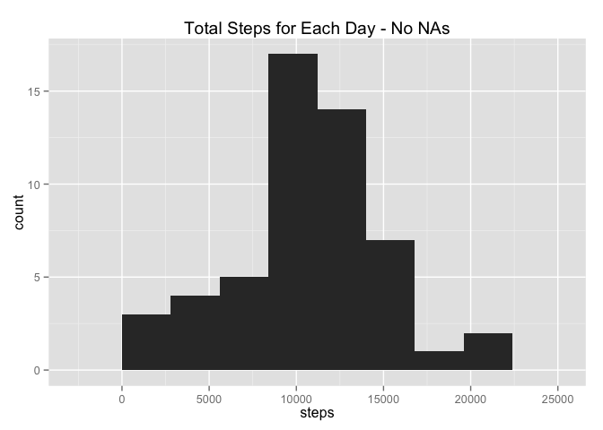
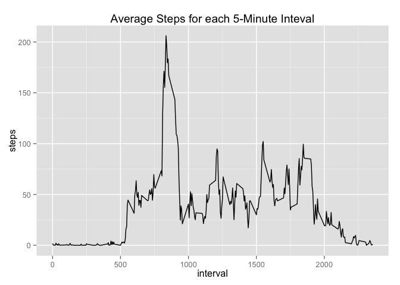
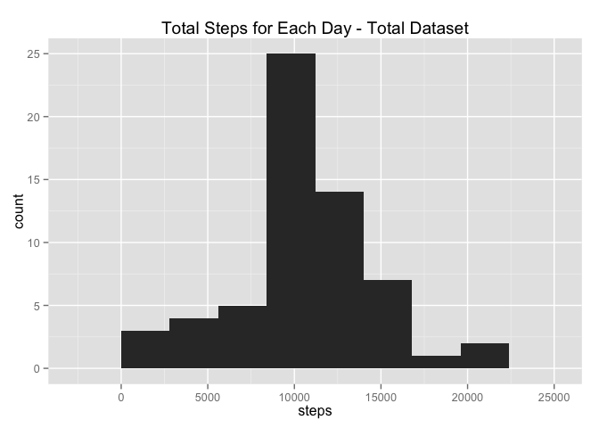
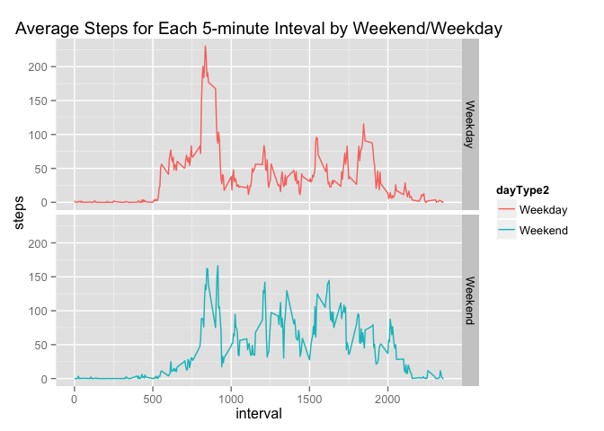

# Reproducible Research: Peer Assessment 1
July 17, 2014  

###Load and preprocess the data
Read in activity data (measured data)


```r
activityData <- read.csv("activity.csv")
```

Remove NAs from the data and sum steps for each day


```r
activityData_NoNA <- activityData[complete.cases(activityData),]
row.names(activityData_NoNA) <- NULL

library(plyr)
stepData <- ddply(activityData_NoNA,.(date), numcolwise(sum))
```

###What is mean total number of steps taken per day?
Make a histogram of the total number of steps taken each day - Exclude NAs 


```r
library(ggplot2)
plot_date <- ggplot(stepData, aes(steps))     
plot_date + geom_histogram(binwidth = 2800) + labs(title = "Total Steps for Each Day - No NAs")
```

 

Calculate the mean and median total number of steps taken per day


```r
mean <- mean(stepData$steps)
median <- median(stepData$steps)

mean
```

```
## [1] 10766
```

```r
median
```

```
## [1] 10765
```

###What is the average daily activity pattern?
Determine the mean total steps per day across 5 minute intervals

```r
intervalData <- activityData_NoNA
intervalData$date <- NULL

mean_intervalData <- aggregate(steps ~ interval, intervalData, FUN = "mean")

summary(mean_intervalData)
```

```
##     interval        steps       
##  Min.   :   0   Min.   :  0.00  
##  1st Qu.: 589   1st Qu.:  2.49  
##  Median :1178   Median : 34.11  
##  Mean   :1178   Mean   : 37.38  
##  3rd Qu.:1766   3rd Qu.: 52.83  
##  Max.   :2355   Max.   :206.17
```

Make a time series plot of the 5-minute interval and the average number of steps taken, averaged across all days 


```r
mean_intervalData$interval <- as.numeric(mean_intervalData$interval)
```


```r
plot_interval <- ggplot(mean_intervalData, aes(interval, steps))     
plot_interval + geom_line() + labs(title = "Average Steps for each 5-Minute Inteval")
```

 

Which 5-minute interval, on average across all the days in the dataset, contains the maximum number of steps?


```r
max_interval <- mean_intervalData[mean_intervalData$steps == max(mean_intervalData$steps),]
row.names(max_interval) <- NULL

max_interval
```

```
##   interval steps
## 1      835 206.2
```

###Impute missing values
Calculate total number of missing values in the dataset


```r
activityData_NAs <- activityData[!complete.cases(activityData),]

nrow(activityData_NAs)
```

```
## [1] 2304
```

Fill in missing steps for NAs - set equal to mean total number of steps taken per day (broken into 5-minute interval)


```r
mean_intervalData$interval <- factor(mean_intervalData$interval) 

activityData_NAs$interval <- factor(activityData_NAs$interval) 

activityData_NAs[, "steps"]  <-  
        mean_intervalData[activityData_NAs[, "interval"], "steps"]
```

Create a new dataset that is equal to the original dataset but with the missing data filled and sum total steps for each day


```r
activityData_total <- rbind(activityData_NoNA, activityData_NAs)

stepData_total <- ddply(activityData_total,.(date), numcolwise(sum))
```

Make a histogram of the total number of steps taken each day - total dataset


```r
plot_totaldata <- ggplot(stepData_total, aes(steps))     
plot_totaldata + geom_histogram(binwidth = 2800) + labs(title = "Total Steps for Each Day - Total Dataset")
```

 

Calculate the mean and median total number of steps taken per day

```r
mean_total <- mean(stepData_total$steps)
median_total <- median(stepData_total$steps)

mean_total
```

```
## [1] 10766
```

```r
median_total
```

```
## [1] 10766
```

The mean and median values do not differ from the estimates from the first part of the assignment.  There is no real impact of imputing missing data on the estimates of the total daily number of steps.

###Are there differences in activity patterns between weekdays and weekends?

Create a new factor variable in the dataset with two levels – “weekday” and “weekend” indicating whether a given date is a weekday or weekend day


```r
activityData_total$dayType <- weekdays(as.Date(factor(activityData_total$date), format = "%Y-%m-%d"), abbreviate = FALSE)

for (i in 1:nrow(activityData_total)) {
     
    if (activityData_total$dayType[i] %in% c("Saturday",      "Sunday")) { 
           activityData_total$dayType2[i] <- "Weekend"
    }
    else {
        activityData_total$dayType2[i] <- "Weekday"
    } 
}

activityData_total$dayType2 <- as.factor(activityData_total$dayType2)
```

Make a time series plot of the 5-minute interval and the average number of steps taken, averaged across all weekday days or weekend days 


```r
activityData_total$interval <- as.numeric(activityData_total$interval)

mean_dayTypeData <- aggregate(steps ~ dayType2 + interval, activityData_total, FUN = "mean")

plot_dayType <- ggplot(mean_dayTypeData, aes(x=interval, y=steps, group = dayType2, color = dayType2))     
plot_dayType + geom_line() + facet_grid(dayType2 ~ .) + labs(title = "Average Steps for Each 5-minute Inteval by Weekend/Weekday")
```

 

